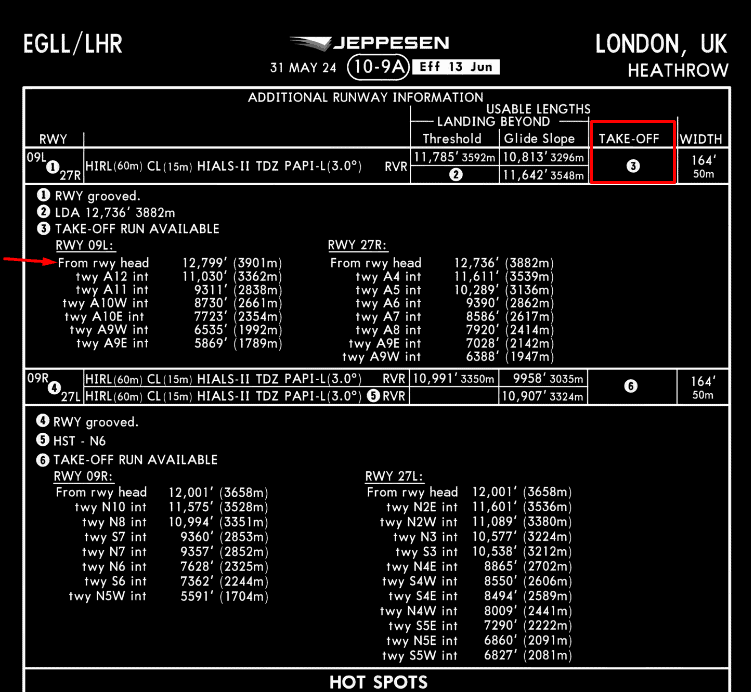
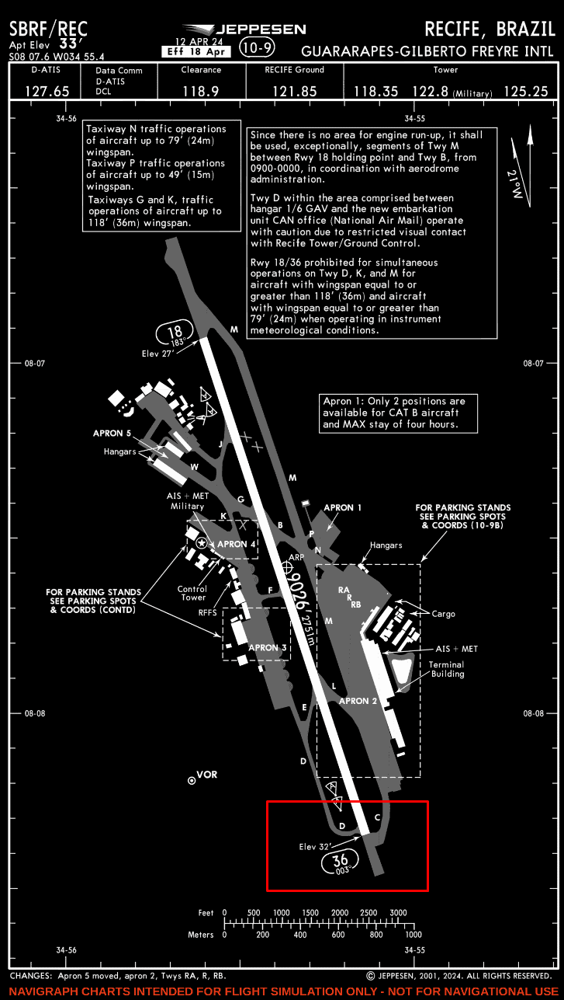

# Calculating Takeoff Performance

This is an advanced guide on how to calculate takeoff performance in the A32NX. This is meant to supplement information the provided in our flyPadOS 3 documentation and usage guide.

[flyPad Performance Calculator Page](../../../../aircraft/common/flypados3/performance.md){ .md-button }

Clicking on the calculate button after all the input fields are filled properly will either result in takeoff speeds and Flex temperature (if Flex was selected and can be used) 
being displayed in the replica of the MCDU Takeoff Perf Pages provided on the right side of the calculator unless the takeoff weight exceeds the maximum takeoff weight for the 
input conditions or if any of the input conditions exceed any airplane limitations. If any of these conditions occur, a suitable error message will pop up.

## Examples

Information that can be obtained from Airport 10-9 (or 10-9A) charts

### EGLL

{loading=lazy}

- Item 1 is the elevation for a takeoff from Runway 09L. 
- Item 2 shows an example of a relatively rare zero-degree turn-on angle from the taxiway to the runway. This is denoted by the gray taxiway extending far enough after the turn 
  to align the airplane with the runway direction before it gets to the beginning of the runway (indicated by the beginning of the black runway diagram). 
- Item 3 is the elevation for a takeoff from Runway 27R. 
- Item 4 shows a common 90-degree entry from the taxiway to the runway, which requires a portion of the runway to align the airplane in the direction of the runway for takeoff.

Since the elevations of both ends of the runway are the same, the slope for takeoffs from both Runway 09L and 27R is zero. 

!!! info "Unmarked In Above Example"
    The magnetic variation for this airport is shown by the arrow on the lower-right side of the chart. 

The magnetic variation at EGLL is 0 degrees, so there is no difference between a true heading and a magnetic heading. No conversion is needed for the METAR wind direction when 
the wind is input manually for this airport.

{loading=lazy}

For a large airport like EGLL, there is not enough space to add the additional runway information on the 10-9 chart. In this case, TORA distance for each runway and for 
intersection takeoffs is provided on the 10-9A chart. For a Runway 09L full-length takeoff, the TORA is 12,799 feet, or 3901 meters.

### SBRF

Be aware that some runways for which the airport 10-9 chart shows a zero-degree runway entry angle, MSFS 2020 has the taxiway aligned such that a 90-degree entry angle is 
required. One example of this is SBRF/Recife, Brazil. The marked area in the airport 10-9 chart below shows that the airplane can be aligned in the direction of takeoff before 
entering the black runway area. In MSFS 2020, however, the taxiway meets the runway end at a 90-degree angle.

{loading=lazy width=75%}

The magnetic variation for SBRF is 21 degrees West. For a magnetic variation in the West direction, add the magnetic variation to the true wind direction referenced to 
true North number to get the magnetic wind direction referenced to true North. For example, if the winds are 240/10 from the METAR, then input 261/10 into the takeoff calculator (240+21).  

!!! info "Rounding"
    You can also round this off to the nearest ten degrees, 260/10, which will probably be what ATIS would give you.

### LOWI

{loading=lazy}

This airport’s 10-9 chart has all the information on one chart. This is an example where both runways have a 180-degree entry angle; that is, the airplane must use the runway 
to taxi to the runway end and then turn around to use the full runway length for takeoff. TORA values for the full runway length as well as from the taxiway 
intersections (where a 90-degree entry angle would apply) are listed in the Additional Runway Information section.

#### Calculating Runway Slope

The runway elevation for each runway is different, so each runway will have a slope value. Use the following equation to calculate the slope value:

!!! info "Slope Equation"
    $$\frac{Elevation\,at\,end\,of\,TORA - Elevation\,at\,beginning\,of\,TORA}{TORA} * 100$$ 

    \[ with\,all\,units\,being\,the\,same.\]

!!! info "Runway 08 Example"
    To calculate the runway slope for Runway 08 the equation with units included would look like the following:

    $$\frac{1894 - 1907}{6562} * 100 = -0.20\%$$

For LOWI, the magnetic variation is 4 degrees East. When the magnetic variation is to the East, subtract the variation from the true wind value to determine winds referenced to the 
magnetic North. If the winds are 240/10 true from the METAR, adjust it to 236/10 when entering it into the takeoff performance calculator. 

Since the magnetic variation is only 4 degrees and winds are normally rounded to the nearest ten degrees, you can also just skip converting the wind reference from true North 
to magnetic North for LOWI.

*[TORA]: Take-Off Run Available
